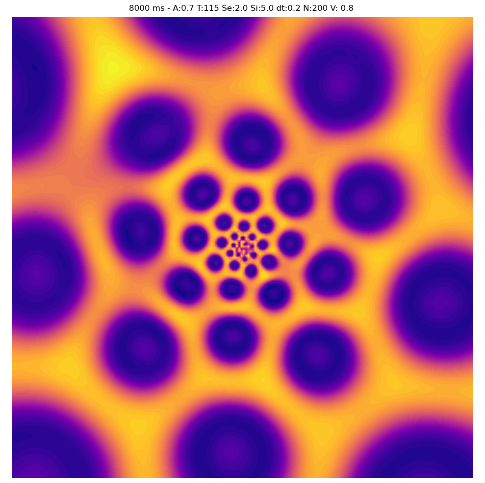
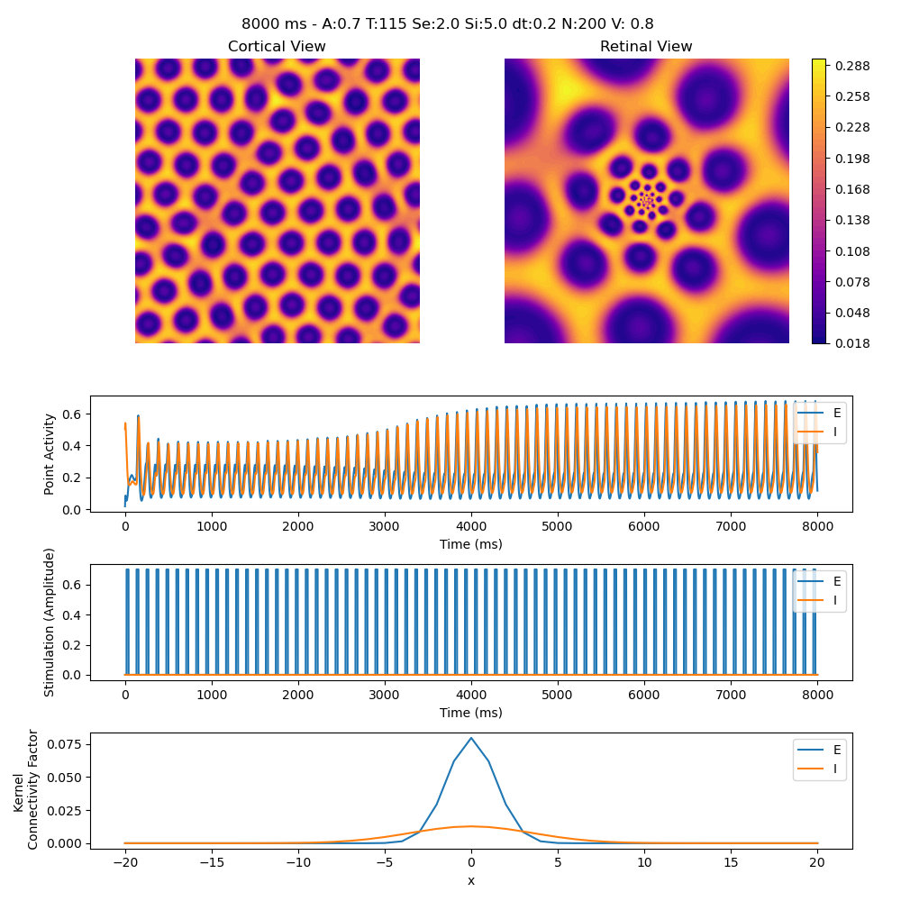

# Python Implementation of the Rule–Stoffregen–Ermentrout (2011) Stroboscopic Hallucination Model
*A project for systematically exploring and creating flicker-induced geometric hallucinations.*

The original paper:
> Rule, M., Stoffregen, M., & Ermentrout, B. (2011). *A Model for the Origin and Properties of Flicker-Induced Geometric Phosphenes*. **PLoS Computational Biology, 7**(9), e1002158. https://doi.org/10.1371/journal.pcbi.1002158

## ⚠️ Safety
**Flashing-light sensitivity warning.** The GIFs contain high-frequency flashing images that be harmful to photosensitive individuals. View with care.

## Features
- **Deterministic runs**: optional fixed random seed for reproducible outputs.
- **Visualization**: interval snapshots, optional GIF export.

## Installation

    git clone <this_repository_URL>
    cd <repository_name>
    python -m venv .venv
    source .venv/bin/activate  # Windows: .venv\Scripts\activate
    pip install -r requirements.txt

## Quick start
Run the simulation script in the CLI, or test out the notebook ```demo.ipynb```. 

CLI demo
```
# Minimal run (time in ms unless stated otherwise)
python -m src.cli --Time 5000 --images both

# Save periodic snapshots and a GIF (GIF timing is 10 ms granularity)
python -m src.cli --Time 5000 --gif --fps 30 --out out/sim.gif
```

- Try period (T) ranges 50–60 to produce roll planiforms and 110–130 for spots
- Adjust the size of the neural field (N) to see how it effects the formation of the patterns
- See [```cli.py```](src/cli.py) for all parameters

## Example outputs

### Images

 

(python -m src.cli --interval 8000 --end 8000 --images both --label --grid-size 200)

### Plots



(python -m src.cli --interval 8000 --end 8000 --plot --label --grid-size 200)

### Gifs 

Examples found in [```assets/gifs```](assets/gifs)) – WARNING: flashing content

## License
MIT. See LICENSE.