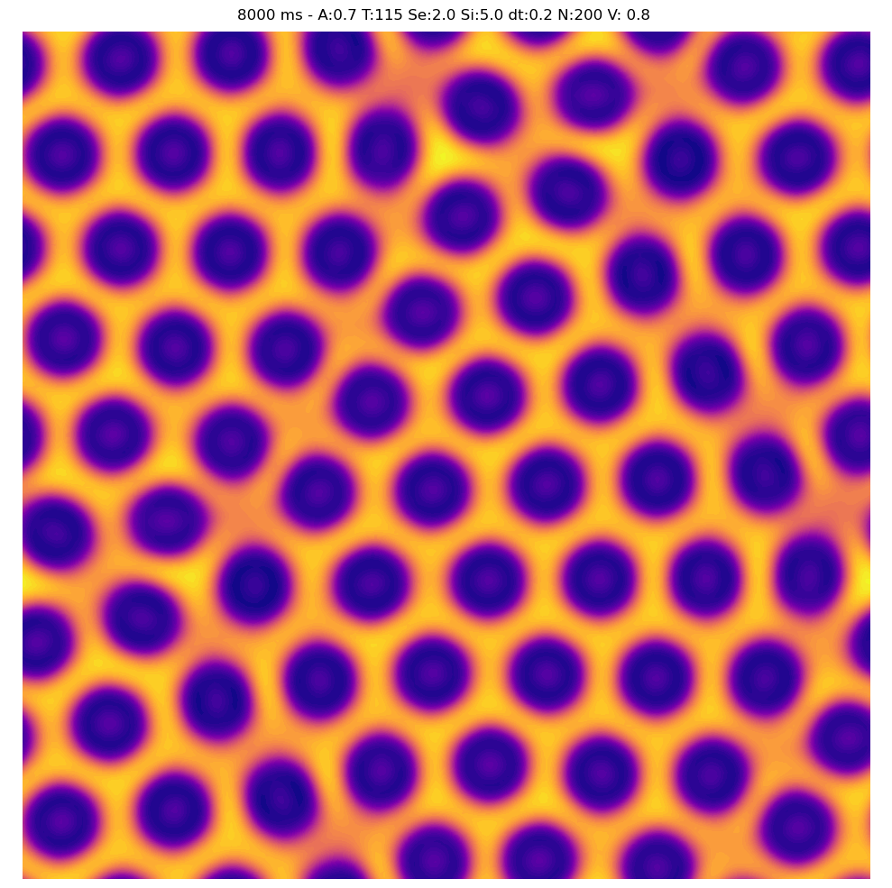
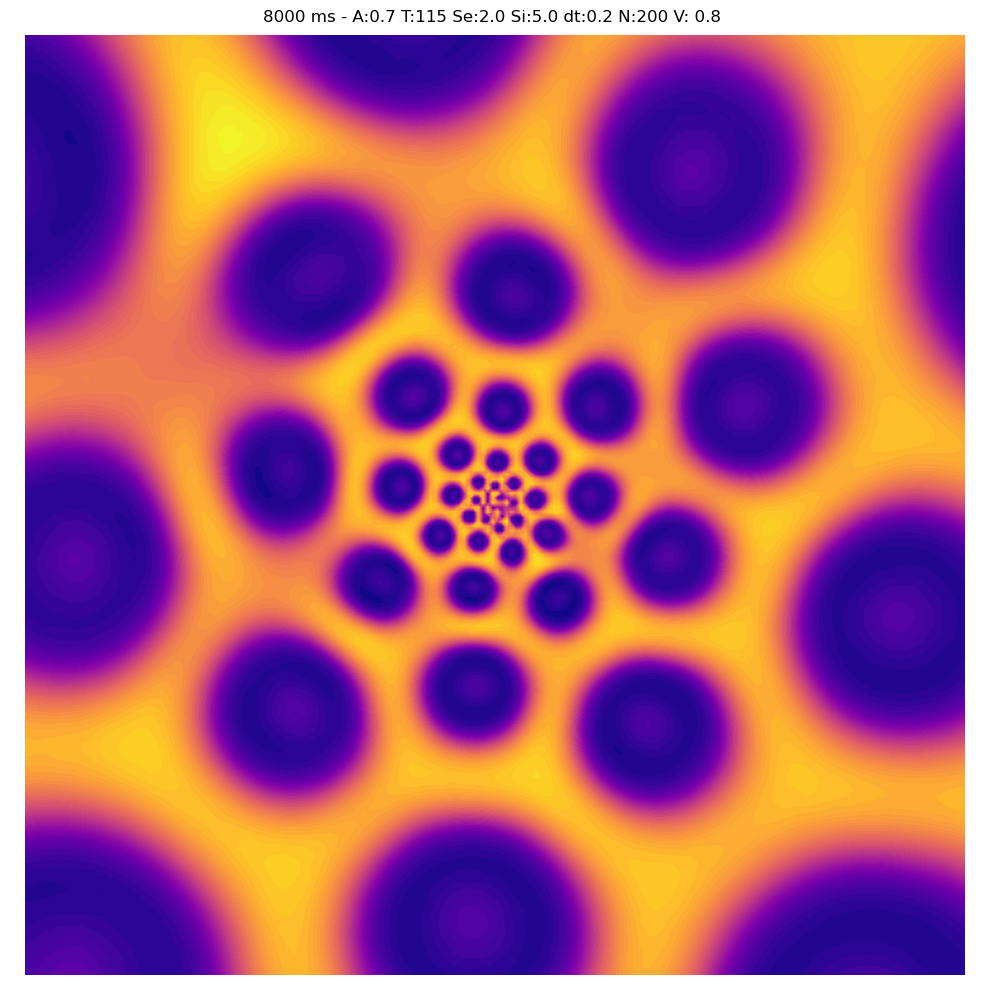
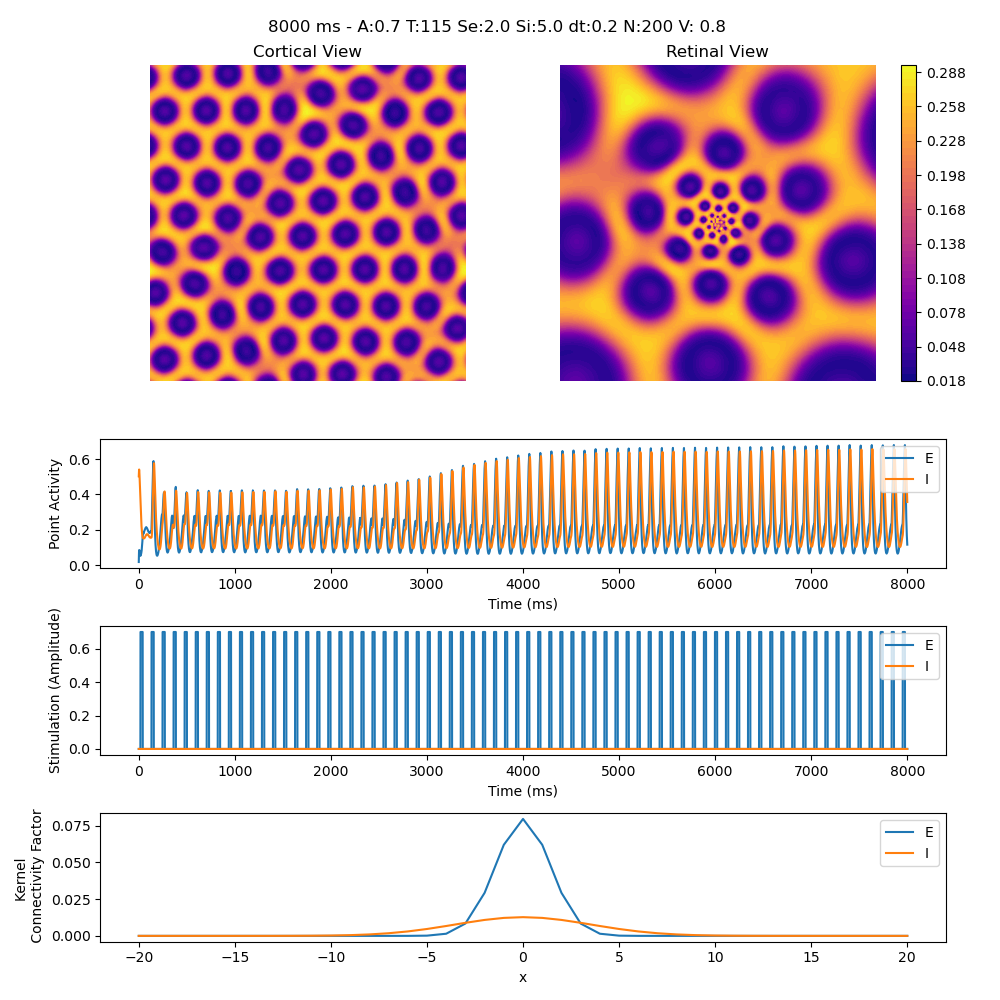

# Python Implementation of the Rule–Stoffregen–Ermentrout (2011) Neural Field Model of Stroboscopic Hallucinations
*Designed for systematic exploration of stroboscopically-induced geometric hallucinations under controlled parameter regimes.*

The original paper:
> Rule, M., Stoffregen, M., & Ermentrout, B. (2011). *A Model for the Origin and Properties of Flicker-Induced Geometric Phosphenes*. **PLoS Computational Biology, 7**(9), e1002158. https://doi.org/10.1371/journal.pcbi.1002158

## ⚠️ Safety
**Flashing-light sensitivity warning.** The GIFs contain high-frequency flashing images that may be harmful to photosensitive individuals. View with care.

## Installation
The code is structured as a reusable simulation package with a command-line interface for reproducible experiments.

    git clone https://github.com/ejgrove/rse_model.git
    cd rse_model
    conda env create -f environment.yml
    conda activate rse-model

## Quick start
The command-line interface [`(cli.py)`](src/cli.py) supports robust and reproducible simulations. A demonstration notebook [`(demo.ipynb)`](notebooks/demo.ipynb) is provided for interactive exploration.

**See [```cli.py```](src/cli.py) for description of all parameters**

## Julia CPU Port
The Julia implementation mirrors the Python command-line options while keeping
the original Python files available for comparison.

```bash
julia --project=. -e 'using Pkg; Pkg.instantiate()'
julia --project=. -e 'using Pkg; Pkg.test()'
julia --project=. src/cli.jl --interval 8000 --end 8000 --images both --label --N 201
julia --project=. src/cli.jl --interval 8000 --end 8000 --images both --label --N 101 --fast-n
julia --project=. src/cli.jl --gpu --interval 8000 --end 8000 --images both --label --N 101 --fast-n
```

The core Julia files are:

- [`src/CommandLine.jl`](src/CommandLine.jl): argument parsing and output routing.
- [`src/Params.jl`](src/Params.jl): model parameters.
- [`src/Kernels.jl`](src/Kernels.jl): Gaussian connectivity kernels.
- [`src/Model.jl`](src/Model.jl): simulation loop and convolution.
- [`src/Visualization.jl`](src/Visualization.jl): retinal transform, PNG heatmaps, compact plots, and GIF output.

For CPU convolution, the current best baseline is planned real-FFT convolution:
the kernels are transformed once with `plan_rfft`, each activity field reuses
the same forward/inverse FFT plans, and intermediate Fourier arrays are
preallocated. This preserves the Python model's circular FFT convolution while
avoiding repeated plan construction and avoiding the extra storage/work of a
full complex FFT.

FFT grid size matters a lot. Odd sizes with only small prime factors are much
faster than awkward prime-heavy sizes. Use `--fast-n` to move to the next
FFT-friendly odd size, for example `101 -> 105` and `201 -> 225`.

```bash
julia --project=. scripts/benchmark_julia.jl --sizes 101,105,135,201,225 --end 100 --passes 2
julia --project=. scripts/benchmark_julia.jl --sizes 101,201 --end 100 --passes 2 --fast-n
```

The benchmark reports `realtime_x`; values above `1.0` mean the simulation loop
is faster than real time for the default model time step (`dt = 0.2 ms`). For
these grid sizes, `--fftw-threads 1` is usually fastest because FFT thread
overhead dominates the small transforms.

## Julia Metal GPU
The Metal backend runs on Apple Silicon GPUs through Metal.jl:

```bash
julia --project=. src/cli.jl --gpu --N 101 --fast-n --end 10000 --interval 10000 --images both
julia --project=. scripts/benchmark_julia.jl --gpu --sizes 105,225,315 --end 100 --passes 2
```

The CLI prints both synchronized simulation compute time and total command time.
The first GPU run includes Julia and Metal compilation, so use the second
benchmark pass for steady-state speed estimates.

By default, `--gpu` uses `--conv auto`, which selects the Metal separable
Gaussian convolution path with `--kernel-cutoff 3`. This is the speed-first path
for real-time experiments. It approximates the full circular FFT convolution by
truncating the separable Gaussian tail, while retaining about 99.996% of the
continuous 2D Gaussian mass before renormalization. Use `--conv fft` for the
exact FFT baseline, or `--kernel-cutoff 4` for an even more conservative
separable approximation.

Representative warmed timings on Apple M4 Pro:

- `--gpu --conv separable --kernel-cutoff 3`, `N=105`: about `0.067 ms/step`, `3.0x` real time.
- `--gpu --conv separable --kernel-cutoff 3`, `N=225`: about `0.192 ms/step`, `1.04x` real time.
- `--gpu --conv fft`, `N=225`: about `0.61 ms/step`, `0.33x` real time.

## Real-Time Applet
Run a local browser applet that streams live frames from Julia over a WebSocket:

```bash
julia --project=. scripts/serve_applet.jl
```

Then open `http://127.0.0.1:8088/`, or use:

```bash
julia --project=. scripts/serve_applet.jl --open
```

The applet exposes the main simulation controls, including duty cycle percentage
and the Metal separable kernel window. It visualizes the cortical sheet and
retinal view as square heatmaps, shows the selected kernel radii/mass retention,
and reports measured `ms / step` plus `real-time x`. GPU mode keeps the model
state on Metal and only transfers one display frame per browser update. The
first run may pause while Julia and Metal compile; subsequent streams are the
useful real-time benchmark.

The applet also includes experimental boundary and coupling controls. Boundary
modes are `periodic`, `edge`, and `zero`, with separate X (left/right) and Y
(top/bottom) selectors; non-periodic boundaries require the Metal separable
convolution path. Coupling mode `midline` runs left and right cortical sheets,
weakly mixes mirrored top/bottom overlap bands, displays the two sheets
side-by-side, and keeps the retinal view square through a simple hemifield
projection.

### CLI examples

### Cortical and Retinal images
```
python -m src.cli --interval 8000 --end 8000 --images both --label --N 201
```

 

*The cortical plot shows activity in visual cortical coordinates, while the retinal plot applies the inverse retino-cortical transform to approximate the perceived hallucination.*


### Plots
```
python -m src.cli --interval 8000 --end 8000 --plot --label --seed 42 --cmap nipy_spectral --T 55
```




### GIFs
```
python -m src.cli --end 8000 --gif --N 101 --seed 43 --cmap nipy_spectral --T 50
```

[```assets/gifs/example4_progression_T50_nipy_spectral.gif```](assets/gifs/example4_progression_T50_nipy_spectral.gif) – WARNING: flashing content


## Tips
- Periods (`--T`) in the range 50–60 ms tend to produce roll-like planforms, while periods around 110–130 ms often yield hexagonal patterns.
- Adjust the size of the neural field (`--N`) to increase the spatial frequency of the patterns. However, increasing `--N` above 250 reduces the stability of the pattern formation.

## More Examples
See [`assets/gifs`](assets/gifs) for more examples – WARNING: flashing content

## License
MIT. See [`LICENSE`](LICENSE/)
